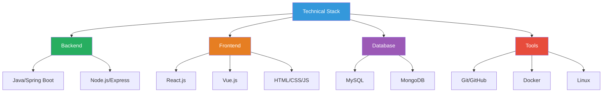

  


Vũ Trung Tín


Full-stack Developer
Java
JavaScript
Network Programming


Full-stack Developer chuyên về **Java Backend** và **JavaScript Frontend** với khả năng xây dựng ứng dụng web hoàn chỉnh từ database đến UI. Sẵn sàng đóng góp vào các dự án web development với kỹ năng vững chắc và tinh thần học hỏi không ngừng.



📧 Liên hệ



💻 GitHub



👤 Facebook


---

## 🎯 Giá trị mang lại


**Tại sao nên làm việc với tôi?**

✅ **Kỹ năng đa dạng**: Full-stack với khả năng làm việc cả Backend (Java, Node.js) và Frontend (React, Vue.js)  
✅ **Nền tảng vững chắc**: Hiểu sâu về OOP, Design Patterns, và Network Programming  
✅ **Tư duy giải quyết vấn đề**: Khả năng phân tích và đưa ra giải pháp kỹ thuật hiệu quả  
✅ **Học hỏi nhanh**: Luôn cập nhật công nghệ mới và áp dụng vào dự án thực tế  
✅ **Làm việc nhóm**: Giao tiếp tốt, sẵn sàng chia sẻ kiến thức và hỗ trợ đồng nghiệp


---

## 💻 Technical Skills

### Backend Development

**Java** ⭐⭐⭐⭐⭐
- Java Core & Advanced (OOP, Collections Framework, Multithreading)
- Spring Boot, Spring MVC, Spring Data JPA
- Socket Programming (TCP/UDP), Network Protocols
- RESTful API Design & Implementation
- JUnit Testing, Maven/Gradle

**Node.js** ⭐⭐⭐⭐
- ES6+ Modern JavaScript, Async/Await
- Express.js Framework
- RESTful APIs & WebSocket
- NPM Package Management
- Error Handling & Middleware

### Frontend Development

**React.js** ⭐⭐⭐⭐
- Component-based Architecture
- React Hooks (useState, useEffect, Custom Hooks)
- State Management
- Responsive UI Development

**Vue.js** ⭐⭐⭐
- Vue Components & Composition API
- Vue Router, Vuex

**Web Fundamentals** ⭐⭐⭐⭐⭐
- HTML5, CSS3 (Flexbox, Grid)
- TailwindCSS, Bootstrap
- Responsive Design (Mobile-first)
- Cross-browser Compatibility

### Database & DevOps

**Databases**
- MySQL - Relational Database Design, Query Optimization
- MongoDB - NoSQL, Document-oriented Database

**Version Control & Tools**
- Git & GitHub - Version Control, Collaboration
- Docker - Containerization (Basic)
- Linux/Unix - Command Line, Shell Scripting

### Technical Stack Overview

---

## 🚀 Core Competencies


**1. Network Programming & Socket Communication**
- Xây dựng ứng dụng Client-Server với TCP/UDP Socket
- Hiểu rõ các giao thức mạng (HTTP, WebSocket)
- Xử lý concurrent connections với Multithreading
- Real-time communication systems

**2. Full-stack Web Development**
- Backend API Development (Java Spring Boot, Node.js)
- Frontend UI Development (React.js, Vue.js)
- Database Design & Optimization (MySQL, MongoDB)
- RESTful API Design & Integration

**3. Software Engineering Best Practices**
- Object-Oriented Programming (OOP) principles
- Design Patterns (Singleton, Factory, Observer, MVC)
- Clean Code & SOLID principles
- Unit Testing & Test-Driven Development (TDD)
- Git Version Control & Collaboration Workflow


---

## 💼 Projects & Experience

### 🔥 Featured Projects


**Network Chat Application** | Java Socket Programming
- Xây dựng ứng dụng chat real-time với Java Socket (TCP)
- Hỗ trợ multiple clients connection với Multithreading
- Giao diện GUI với JavaFX/Swing
- **Tech Stack**: Java, Socket Programming, Multithreading, JavaFX

**E-commerce Web Application** | Full-stack Project
- Backend RESTful API với Spring Boot
- Frontend responsive với React.js
- Database MySQL, JWT Authentication
- **Tech Stack**: Spring Boot, React, MySQL, JWT, TailwindCSS

**Blog Platform** | Static Site Generator
- Personal blog với Hugo và Blowfish theme
- SEO optimization, responsive design
- Automated deployment với GitHub Actions
- **Tech Stack**: Hugo, Markdown, TailwindCSS, Netlify


Xem thêm projects tại [GitHub](https://github.com/vutrungtin2004) 💻

---

## 🎓 Education & Learning




**Sinh viên Công nghệ Thông tin**
- Chuyên ngành: Công nghệ Phần mềm / Mạng máy tính
- Các môn học chính: OOP, Data Structures, Algorithms, Database, Network Programming



**Tự học & Online Courses**
- Java Spring Boot Development
- React.js & Modern JavaScript
- Network Programming & Socket
- Design Patterns & Best Practices



**Knowledge Sharing**
- Xây dựng blog cá nhân với 9+ technical articles
- Chia sẻ kiến thức về Java, JavaScript, Network Programming
- Tham gia các developer communities




---

## 🎯 Career Goals


**Mục tiêu nghề nghiệp**

💼 **Ngắn hạn (6-12 tháng)**
- Tìm kiếm cơ hội **Intern/Junior Developer** tại các công ty công nghệ
- Tích lũy kinh nghiệm làm việc trong môi trường thực tế
- Nâng cao kỹ năng Spring Boot, Microservices, và System Design
- Đóng góp cho các dự án open-source

🚀 **Dài hạn (1-3 năm)**
- Phát triển thành **Mid-level/Senior Full-stack Developer**
- Chuyên sâu về Backend Architecture và System Design
- Có khả năng lead team và mentor junior developers
- Đóng góp tích cực cho tech community


---

## 📫 Contact Information


**Sẵn sàng cho cơ hội mới!**

Tôi đang tìm kiếm vị trí **Intern/Junior Full-stack Developer**. Nếu bạn có cơ hội phù hợp hoặc muốn trao đổi về công nghệ, hãy liên hệ với tôi qua các kênh dưới đây:


### 📧 Email
**tintieutu0104@gmail.com**

Best for:
- Job opportunities
- Project collaboration
- Technical discussions

### 💻 GitHub
**[vutrungtin2004](https://github.com/vutrungtin2004)**

Check out:
- Source code & projects
- Open-source contributions
- Code quality & style

### 👤 Facebook
**[Vũ Trung Tín](https://www.facebook.com/vu.trung.tin.657543)**

Connect with me:
- Professional networking
- Tech community
- Quick messages


📧 Send me an email



💻 View GitHub Profile


---

## 💡 Why Hire Me?


**Value I bring to your team:**

✨ **Fresh Perspective**: Sinh viên năm cuối với kiến thức cập nhật về công nghệ mới nhất  
💪 **Strong Foundation**: Nền tảng vững về Java, JavaScript, và Web Development  
🚀 **Fast Learner**: Khả năng học hỏi và thích nghi nhanh với công nghệ mới  
👥 **Team Player**: Làm việc nhóm tốt, sẵn sàng học hỏi từ senior developers  
📚 **Knowledge Sharing**: Passion cho việc chia sẻ kiến thức qua blog và technical writing  
💼 **Professional Attitude**: Nghiêm túc, trách nhiệm, và đam mê với công việc


---

## 🎯 What I'm Looking For


**Cơ hội làm việc lý tưởng:**

- 💼 **Position**: Intern/Junior Full-stack Developer hoặc Backend/Frontend Developer
- 🏢 **Company**: Startup hoặc công ty công nghệ có văn hóa học hỏi và phát triển
- 📍 **Location**: Flexible (onsite/hybrid/remote)
- ⏰ **Type**: Full-time Internship hoặc Part-time (flexible với lịch học)
- 🎯 **Tech Stack**: Java/Spring Boot, Node.js, React/Vue.js, hoặc tương tự

**What I value:**
- 🌱 Learning opportunities và mentorship từ senior developers
- 🚀 Làm việc với real-world projects
- 👥 Collaborative team environment
- 📚 Continuous learning culture


---

## 📝 Blog & Knowledge Sharing


**About this blog:**

Blog này là nơi tôi chia sẻ kiến thức và kinh nghiệm học tập về lập trình. Với **9+ technical articles** về Java, JavaScript, và Network Programming, tôi tin vào việc "học bằng cách dạy" - teaching is the best way to solidify knowledge.

**Tech Stack**: Hugo + Blowfish Theme + Netlify + GitHub Actions

**Topics**: Java Programming | JavaScript & Node.js | Network Programming | Web Development | Best Practices


---

### 🤝 Let's Connect!


"Always open to new opportunities and collaborations"



📖 Read My Articles



📧 Get In Touch


---

**Vũ Trung Tín** | Full-stack Developer  
📧 tintieutu0104@gmail.com | 💻 [GitHub](https://github.com/vutrungtin2004) | 👤 [Facebook](https://www.facebook.com/vu.trung.tin.657543)

*"Code with passion, learn with curiosity, grow with consistency"*

